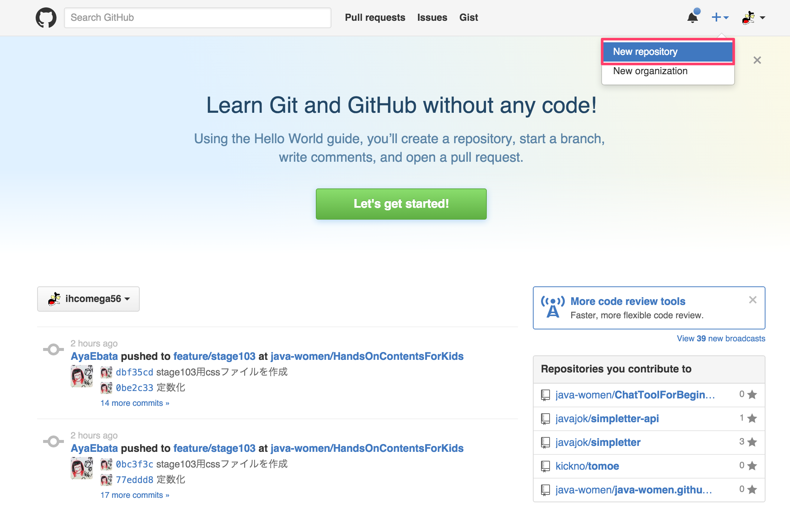
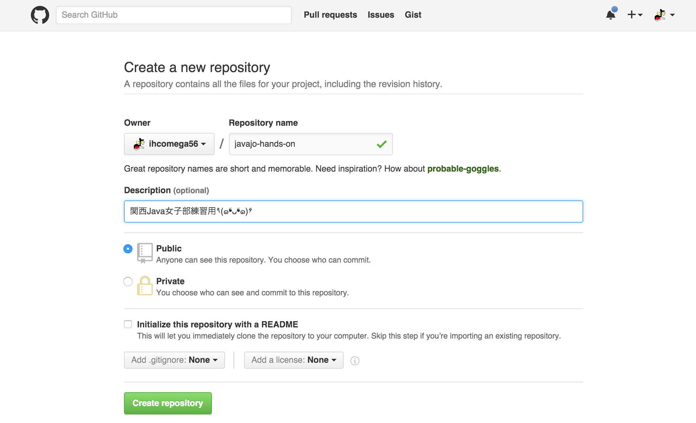
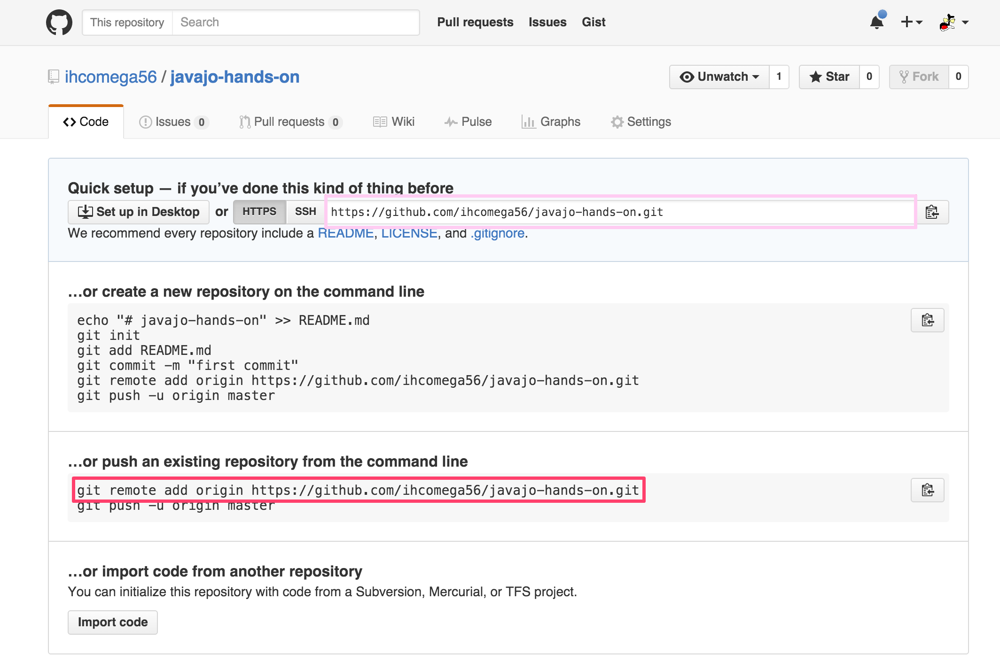

#  HandsOn

## ひとりでもくもくやってみよう編  

**必要な初期設定をしよう。**  

1. ユーザ名を設定しよう  
    1. `git config --global user.name "namae"`  

1. メールアドレスを設定しよう  
    1. `git config --global user.email "adoresu@adoresu.com"`  
 
1. 設定を確認しよう  
    1. `git config --list`  

**ターミナルを使う準備をしよう**  
※ターミナルでの作業に慣れている方は任意のディレクトリを使ってね  

1. ターミナルを起動しよう

1. ユーザーのホームディレクトリに移動しよう
    1. `cd ~`  
    ホームディレクトリに移動する
    1. `pwd`  
    今いる(使っている)ディレクトリを確認する  

**リポジトリをクローンしよう。**  

1. ハンズオン資料をクローンしよう  
    1. `git clone https://github.com/ihcomega56/git-handson.git`  
    `git-handson`というディレクトリが作成されるよ！  

**リポジトリを作って、コミット・プッシュしよう。**  

1. ローカルリポジトリを作ろう  
    1. `mkdir git-practice`  
    `git-practice`というディレクトリを作る  
    1. `cd git-practice`  
    作った`git-practice`に移動する  
    1. `git init`  
    リポジトリを作り`git-practice`をGitで管理出来るようにする  

1. .gitディレクトリが出来ているのを確認しよう  
    1. `ls -la`  
    `-a`オプションで隠しファイル/ディレクトリも表示されるよ！  
    1. Windows: `start .` / Mac: `open .git`  
    エクスプローラ/Finderで表示も可能！ターミナルに不慣れな場合、このウィンドウを開いておくと便利だよ  

1. ファイルを作ってステージに追加しよう  
    1. `vi self-introduction.txt`  
    `self-introduction.txt`ファイルを作り、自分の名前を書いて保存する  
    ※`vi`を使わずお好みのテキストエディタを使ってOK！さっき開いたエクスプローラ/Finderのウィンドウを使ってファイルを追加してね(これ以降、`vi`コマンドが出てきたらテキストエディタでの編集を意味していると考えてね)
    1. `git status`  
    ステージの状況を確認する  
    1. `git add self-introduction.txt`  
    編集した内容をステージする  
    1. `git status`  
    ステージの状況を確認する  

1. ローカルリポジトリにコミットしよう  
    1. `git commit -m "Initial commit"`  
    最初のコミットコメントは`Initial commit`とか`First commit`とすることが多いよ  
    1. `git status`  
    ステージの状況を確認する  

1. ログを確認しよう
    1. `git log`  
    ログの表示はいろいろな方法があるよ！:[参考](GitLog.md)  

1. GitHubにリモートリポジトリを作ろう  
      
    右上のメニューから`New repository`を選択してね  
      
    `Repository name`にリポジトリ名をいれてね (今回は`git-practice`)  

1. 作成したリモートリポジトリをローカルで追加しよう  
    1. `git remote add origin https://github.com/XXXXXX/git-practice.git`  
      
    コマンドをここでコピーできるよ  

1. リモートリポジトリにプッシュしよう  
    1. `git push -u origin master`  
    GitHubのユーザネーム、パスワードを入力する必要があるよ  

**新しいブランチで作業し、元のブランチにマージしよう。**  

1. 今あるブランチを確認しよう  
    1. `git branch`  
    `master`しかないことを確認する  

1. ブランチを作成しよう  
    1. `git branch first-branch`  
    `first-branch`ブランチを作成する  
    1. `git branch`  
    `master`と`first-branch`があるが、今は`master`ブランチにいることを確認する  

1. ブランチを切り替えよう  
    1. `git checkout first-branch` / `git switch first-branch`  
    作業する場所を`master`ブランチから`first-branch`ブランチに切り替える  
    1. `git branch`  
    現在のブランチが`first-branch`になっていることを確認する  

1. first-branchブランチでファイルを編集してコミットしよう  
    1. `vi self-introduction.txt`  
    `self-introduction.txt`に自己紹介を付け足して保存する  
    1. `git commit -am "XXXを追記しました"`  
    `-a`オプションを追加することで変更をすべてステージしてコミットできるよ！  

1. ログを確認しよう  
    1. `git log`  

1. masterブランチとの差分を確認しよう  
    1. `git diff master`  
    ローカルの`master`ブランチと比較する  
    1. `git diff origin/master`  
    リモートの`master`ブランチと比較する  
    差分の表示はいろいろな方法があるよ！:[参考](GitDiff.md)  

1. first-branchブランチをmasterブランチにマージしよう  
    1. `git checkout master` / `git switch master`  
    `master`ブランチに切り替える  
    1. `git merge first-branch`  
    viエディタが立ち上がってマージコミットのコメントを編集できる(マージの際はたいてい編集せずデフォルトのままでOK)  

1. ログを確認しよう  
    1. `git log`  

**ブランチをプッシュしてみよう。**

1. GitHub上にあるブランチを確認しよう  
    `master`しかないことを確認する  

1. `first-branch`ブランチをプッシュしよう
    1. `git push origin first-branch`  

1. GitHub上にあるブランチを確認しよう  
    `master`と`first-branch`があることを確認する  

**コンフリクトを解消しよう。**  

1. コンフリクトを発生させよう  
    1. `vi self-introduction.txt`  
    `first-branch`ブランチで作業する  
    `self-introduction.txt`に自己紹介を付け足して保存する  
    1. `git commit -am "XXXを追記しました"`
    コミットする
    1. `git checkout master` / `git switch master`  
    `master`ブランチに切り替える  
    1. `vi self-introduction.txt`  
    `self-introduction.txt`に自己紹介を付け足して保存する  
    1. `git commit -am "XXXを追記しました"`
    コミットする
    1. `git merge first-branch --no-ff`  
    `--no-ff`オプションをつけてマージする  
    CONFLICTの文字が現れるはず・・・！  

1. コンフリクトを解消しよう  
    1. `vi self-introduction.txt`  
    残す内容、消す内容を判断して編集し、🐟の骨(`<<<<<<<`と`=======`と`>>>>>>>`)をなくす  
    1. `git add self-introduction.txt`  
    納得行く内容になったらステージする  
    1. `git commit -m "コンフリクトを解消しました"`  
    コミットする  
